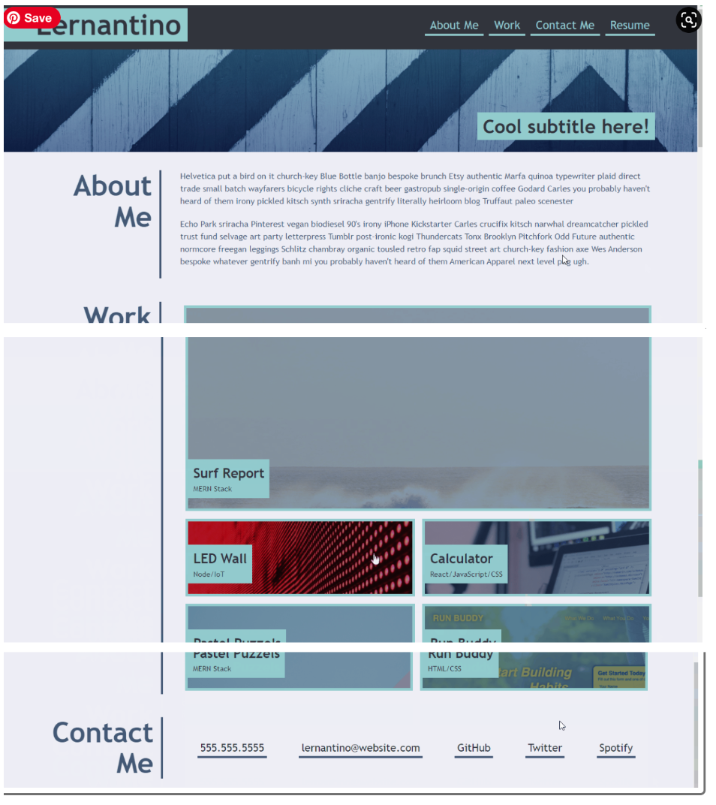

# HTML Portfolio
Module 2 Assignment

## Description
This project was to practice building a website from scratch using HTML and CSS. 

Solving the problems of this project taught me to better understand the possibilities of CSS and use flexbox to organize content. 

Link to deployed site here: <
## Table of Contents

- [Languages Used](#languages)
- [Mockup](#mockup)
- [Credits](#credits)
- [Resources](#resources)

## Languages Used
The following languages were used to create this project:

-HTML

-CSS

## Mockup

The following image was the mockup provided to document expectations for the final product. 

## Credits

This project was completed as part of Georgia Tech's Full Stack Development Boot Camp course.  Original mock-up belongs to Georgia Tech.

## Resources

The following resources were helpful in researching best practices and problem-solving on the project.

-HTML: <https://www.w3schools.com/html/html5_semantic_elements.asp>
-HTML Hyperlinks:  <https://www.w3schools.com/html/html_links.asp>
-HTML Textbox for Images: <https://www.w3schools.com/howto/howto_css_image_text_blocks.asp>

-CSS: <https://developer.mozilla.org/en-US/docs/Web/CSS>
-CSS Flexbox: <https://developer.mozilla.org/en-US/docs/Web/CSS/CSS_Flexible_Box_Layout/Basic_Concepts_of_Flexbox>
-CSS Flexbox Cheat Sheet: <https://css-tricks.com/snippets/css/a-guide-to-flexbox/>
---
